# How the space layout writes a hub

Every picture below is a real scenario from the harness, and every row is what the
tool's patch wrote for it. `docs/hub-layout-shots.mjs` rebuilds the pictures and
saves each patch next to them (`docs/img/hub-*.patch.txt`), so this page can be
re-checked after any change.

The rule underneath all of it: **the drawing is recreated from the DB alone.** A hub
is Parameter Syntax (pages 100966 and 1410108) on three kinds of row:

| Row | Column | Holds |
|---|---|---|
| hub Position | `Parameters` | `[[w,h,d]]` the whole hub, `<A.1[w,h,d,dx,dy,dz],...>` its bays |
| driver Element | `ContextParameters` | `[x,y,z]<A.1>` where it sits, in which bay |
| driver Element | `Parameters` | as-placed size when turned; `<JB.n[...]>` junction boxes |
| ElementType | `Parameters` | `[w,h,d]`; for a wrapper, `<PSU(ET-...)[...],Driver(ET-...)[...]>` |

A space name is `Group.Bay`. **The group is a piece of joinery, the number is a bay
in it.** `dx` and a driver's `x` are measured from that piece's own origin. Sizes are
millimetres, `x` from the left, `y` from the top.

Refs below are the harness's fixtures. `E5000X` is the placeholder for a row the
patch appends; the workbook allocates the real Ref.

---

## 1. A hub nobody has laid out

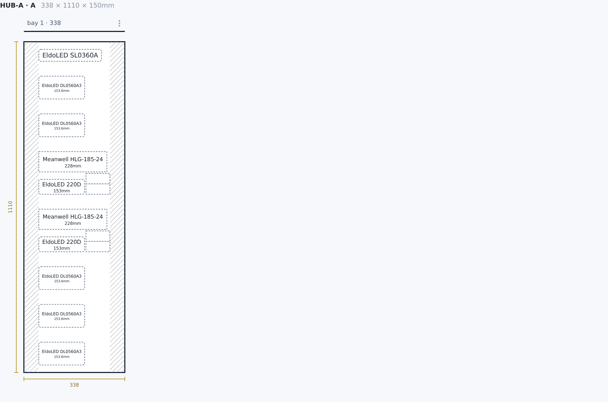
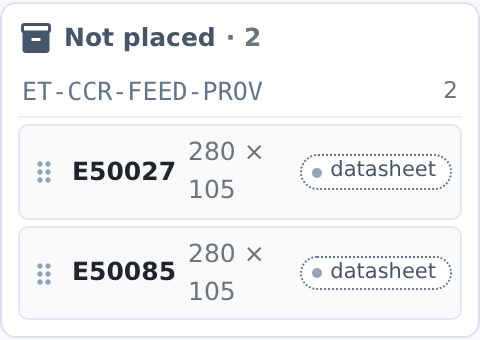

The hub has drivers but no stored layout. On opening, the tool places every driver it
recognises (CC, CV or LED output nodes) into bay 1 and leaves the rest in the tray.
Those placements reach the DB only when the patch runs:

```
E50019  ContextParameters  [50mm,25mm,0mm]<A.1>
E50020  ContextParameters  [50mm,151.7mm,0mm]<A.1>
E50022  ContextParameters  [50mm,405.1mm,0mm]<A.1>
hub     Parameters         [[338mm,1110mm,150mm]]<A.1[...]>
```

Feeds are not drivers, so they wait in the tray until someone places them.

## 2. Not placed

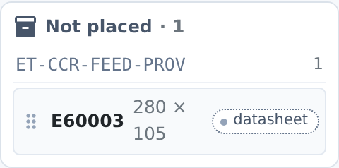

**Not placed is the absence of a space.** An Element contexted into the hub whose
`ContextParameters` names no `<space>` is in the hub but not placed. The tool lists
it in the tray, and anything else that draws a hub should list it too, not drop it.

```
E60003  ContextType Position  ContextRef p60001  ContextParameters (blank)
```

That is the DB as it stands: the patch leaves an item in the tray alone. Dragging a
placed block back to the tray writes its `ContextParameters` blank.

## 3. Early design: Elements, no cables

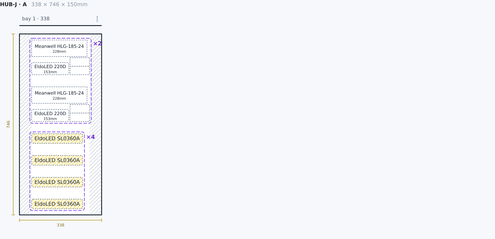

An estimate hub (Positions only, drivers patched in from the estimate). Same rules;
the layout does not need cables.

```
hub     Parameters         [[338mm,746mm,150mm]]<A.1[...]>
E60001  ContextParameters  [50mm,25mm,0mm]<A.1>
E60002  ContextParameters  [50mm,385mm,0mm]<A.1>
```

E60003, the feed, stays in the tray and is not in the patch.

## 4. Two bays standing together

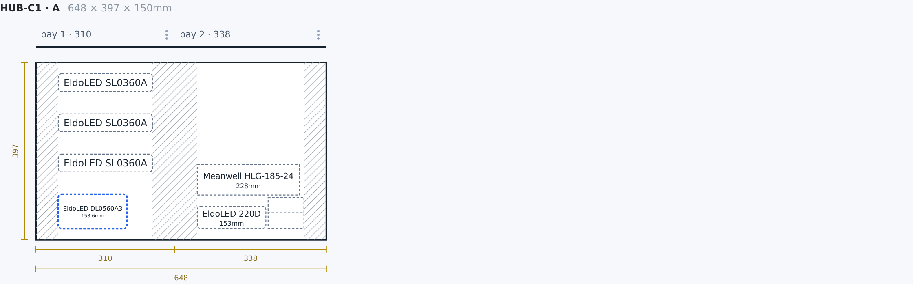

Two bays in one piece of joinery, so both are group `A`. Each keeps its own trunking.

```
hub     Parameters         [[648mm,397mm,150mm]]<A.1[310mm,397mm,150mm,0,0,0],A.2[338mm,193mm,150mm,310mm,0,0]>
E50046  ContextParameters  [50mm,25mm,0mm]<A.1>
E50044  ContextParameters  [360mm,25mm,0mm]<A.2>
```

`A.2` starts at `dx` 310mm, so E50044's `x` of 360mm is 50mm into bay 2.
`[[648mm,397mm,150mm]]` is the widths summed and the tallest height.

## 5. A bay separated: space groups

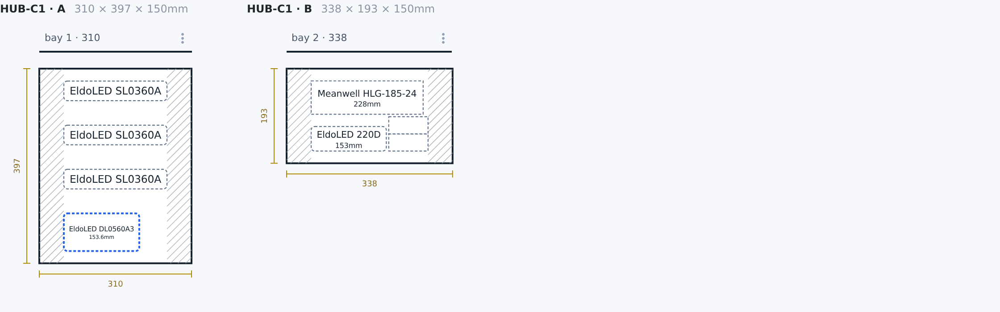

Bay 2 marked **Separate** in its menu becomes its own piece, group `B`. This is the
default: nothing but the hub row changes.

```
hub     Parameters         [[648mm,397mm,150mm]]<A.1[310mm,397mm,150mm,0,0,0],B.1[338mm,193mm,150mm,0,0,0]>
E50046  ContextParameters  [50mm,25mm,0mm]<A.1>
E50044  ContextParameters  [50mm,25mm,0mm]<B.1>
```

`B.1` has `dx` 0 and E50044 is back to `x` 50mm: each piece measures from its own
origin, so each redraws as its own sheet.

A row written before groups (`<1,2>` or `<1[...],2[...]>`) reads as group A.

## 6. Enclosure Elements (optional)

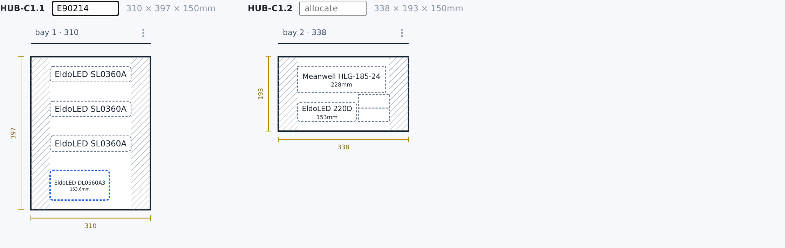

With **Enclosure Elements** on, every piece gets one `ET-PSU-ENC` Element under the
hub, not only the piece split off. Each sheet heading takes the enclosure's Ref.

```
E90214  Name HUB-C1.1  TypeRef ET-PSU-ENC  ContextRef p50123  Parameters [[310mm,397mm,150mm]]<1[310mm,397mm,150mm,0,0,0]>
E5000X  Name HUB-C1.2  TypeRef ET-PSU-ENC  ContextRef p50123  Parameters [[338mm,193mm,150mm]]<1[338mm,193mm,150mm,0,0,0]>
E50046  ContextType Element  ContextRef E90214  ContextParameters [50mm,25mm,0mm]<1>
E50044  ContextType Element  ContextRef E5000X  ContextParameters [50mm,25mm,0mm]<1>
hub     Parameters cleared
```

Inside an enclosure the space is just the bay number. The toggle opens on when the DB
already has enclosure rows under the hub. Turning it off moves the drivers back onto
the hub Position first, then marks the enclosures `IsDeleted`, never through the
cascade (which would take the drivers with them).

## 7. A turned driver, and a Quantity row

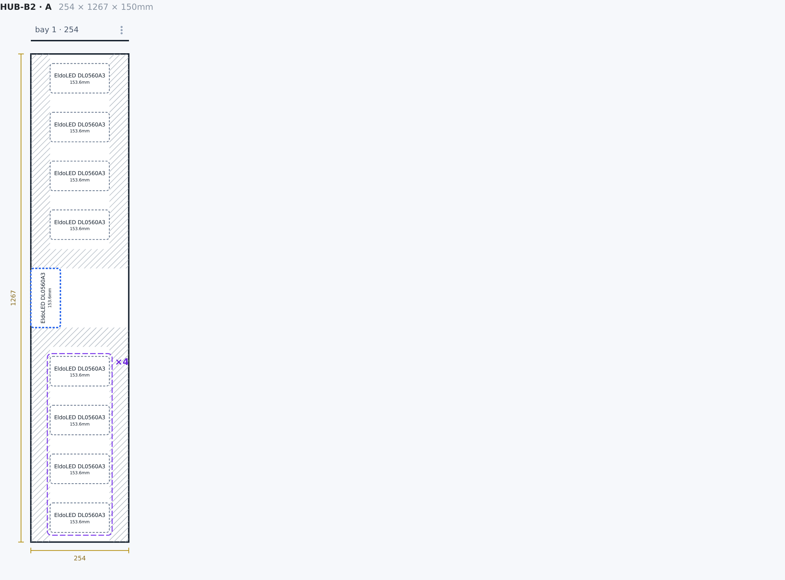

**Rotate** turns a driver 90 degrees. Its type is not touched: the Element carries its
as-placed size.

```
ET-CCR-D-300-2CH-01  Parameters         [153.6mm,76.7mm,30.6mm]
E50029               Parameters         [76.7mm,153.6mm,30.6mm]
E50029               ContextParameters  [0mm,556.8mm,0mm]<A.1>
```

E50028 in the same picture is one row with `Quantity` 4, drawn as a stack with a ×4
badge. Nothing new is written for a stack.

## 8. Breaking a Quantity apart

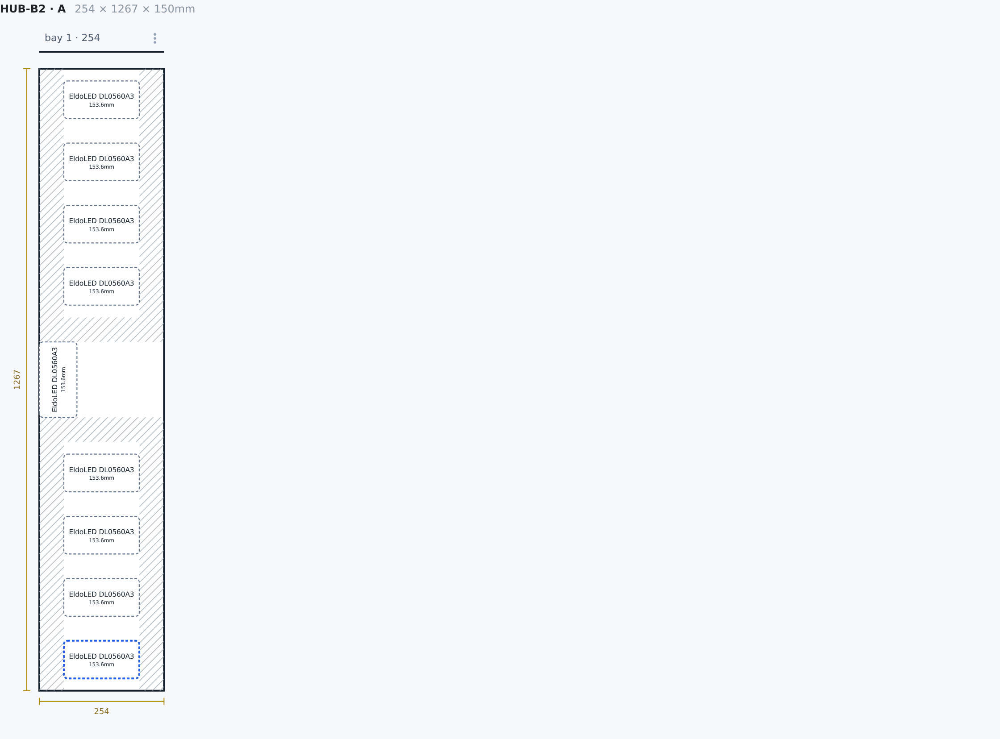

**Break apart** turns the one row into four. The original keeps its Ref, the rest are
appended with the same type and hub, and no quantity is left hanging:

```
E50028  Quantity 1  ContextParameters [50mm,25mm,0mm]<A.1>
E5000X  TypeRef ET-CCR-D-300-2CH-01  ContextRef p50123  (x3)
```

The new rows then need Refs assigned in the DB, as elsewhere. A driver with a
Quantity never has cables assigned, so there is nothing to split there.

## 9. A driver's parts: a CV wrapper

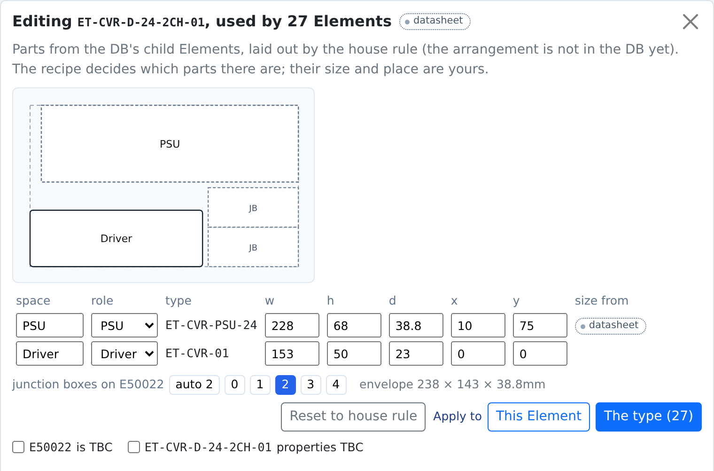
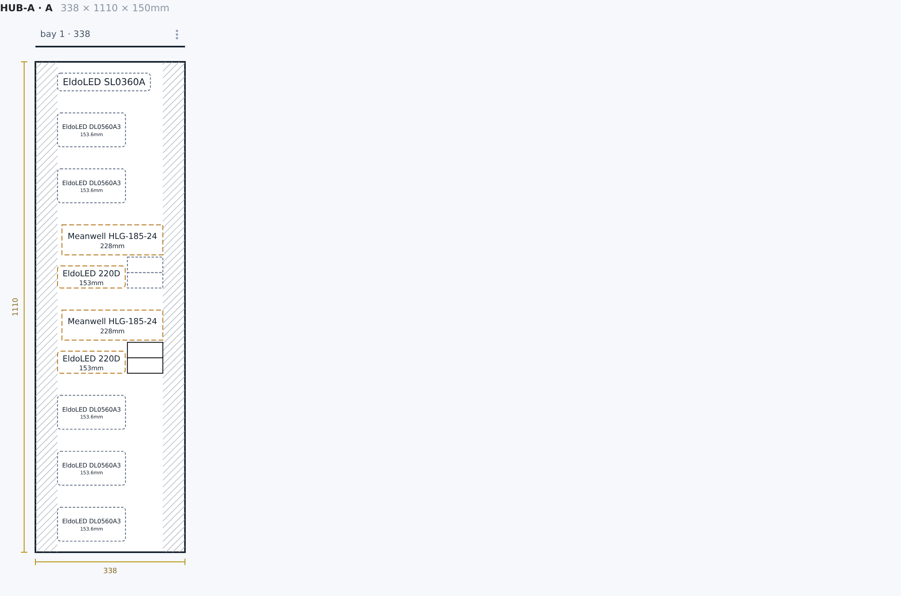

A CV driver such as `ET-CVR-D-24-2CH-01` is a DC/DC driver and its power supply. The
pencil on hover opens the part editor. **The type** applies to every Element of the
type (27 here) and writes the wrapper type's `Parameters`:

```
ET-CVR-D-24-2CH-01  Parameters  [238mm,143mm,38.8mm]<PSU(ET-CVR-PSU-24)[228mm,68mm,38.8mm,10mm,75mm,0],Driver(ET-CVR-01)[153mm,50mm,23mm,0,0,0]>
```

`[238mm,143mm,38.8mm]` is the envelope; each part is `Space(ChildType)[w,h,d,dx,dy,dz]`
inside it. The PSU is moved 10mm right here, so the envelope grew from 228mm.
Before anyone edits it, the parts come from the type's child Elements and the house
rule, and that arrangement is written the first time the patch runs.

Junction boxes belong to the driver Element, not the type:

```
E50022  Parameters  <JB.1[80mm,35mm,40mm,158mm,0,0],JB.2[80mm,35mm,40mm,158mm,35mm,0]>
```

## 10. Sizes

Every size the drawing uses is marked **datasheet**, **edited** or **missing**
until it is in the DB. The patch writes a size to every ElementType the hub uses, not
only the one you touched:

```
ET-CCR-D-350-1CH-01  Parameters  [210mm,40mm,33.5mm]
ET-CVR-PSU-24        Parameters  [228mm,68mm,38.8mm]
```
